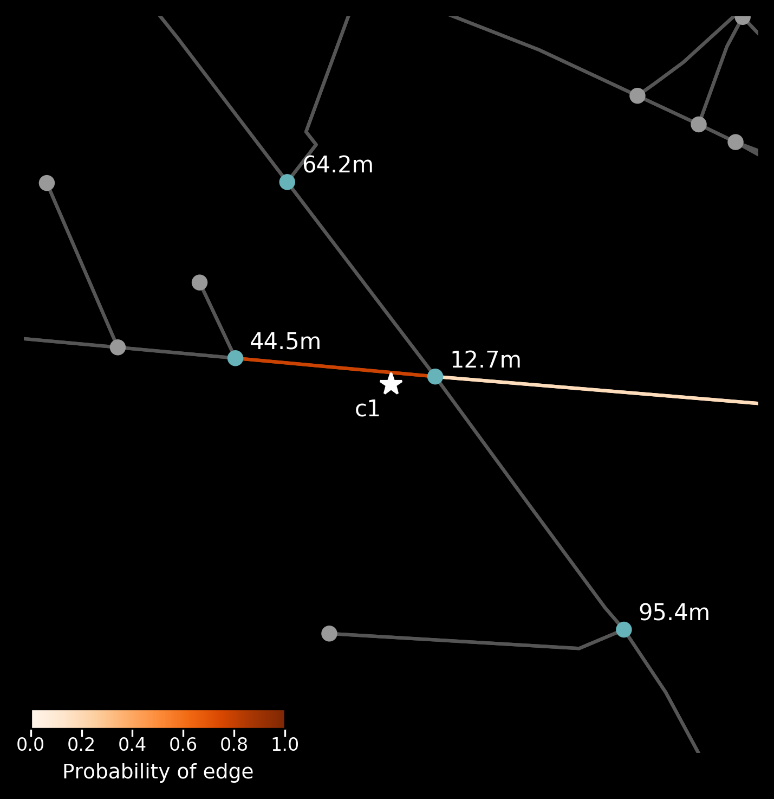

[](https://badge.fury.io/py/anprx)
[](https://travis-ci.org/PedrosWits/anprx)
[](https://anprx.readthedocs.io/en/latest/?badge=latest)

# ANPRx

Traffic analysis using networks of Automatic Number Plate Recognition cameras.

## Installation

ANPRX is available through pypi:
```
pip install anprx
```

See `requirements.txt` for a complete list of dependencies.

**Important:**
[OSMnx](https://github.com/gboeing/osmnx) requires the [Rtree](http://toblerity.org/rtree/) package which is a python wrapper for [libspatialindex](https://libspatialindex.github.io/). To get osmnx to work properly, which this package heavily relies on,  [download and install](.travis.yml) [libspatialindex](https://libspatialindex.github.io/) first.

## Features

- Obtain a model of the drivable street network, using [osmnx](https://github.com/gboeing/osmnx) and [networkx](https://networkx.github.io/documentation/stable/index.html), that encompasses the traffic cameras (coordinate points).

```python
from anprx.core import Point
from anprx.core import get_surrounding_network

# Using the same dummy location twice
locations = [ Point(lat = 54.974537,
                    lng = -1.625644),

              Point(lat = 54.974537,
                    lng = -1.625644)]

network = get_surrounding_network(locations)
```

- Instantiate camera objects whose __observed__ network edge is implicitly estimated. If the camera's address has been annotated by a human, you can use it to remove candidate edges with a different address.

```python
import networkx as nx
from anprx.core import Camera

# With address filtering - only nearby edges with the
#                          given address are considered
mock_camera1 = Camera(
  network = network,
  id = "c1",
  point = locations[0],
  address = "Pitt Street, Newcastle Upon Tyne, UK")

# Without address filtering - all nearby edges are considered
mock_camera2 = Camera(
  network = network,
  id = "c2",
  point = locations[1])

# chosen edge
mock_camera1.edge
mock_camera2.edge

# proportion of valid points for each candidate edge
mock_camera1.p_cedges
mock_camera2.p_cedges

# then you can compute routes between cameras
route = nx.shortest_path(network,
                         source = mock_camera1.edge.u,
                         target = mock_camera2.edge.v,
                         weight = 'length')
```

- Visualise the camera's placement on the road network, including nearby nodes, and the likelihood of candidate edges.

```python
from anprx.plot import plot_camera

plot_camera(mock_camera1)
plot_camera(mock_camera2)
```

Mock camera on Pitt Street with address filtering |  Mock camera on Pitt Street without address filtering
:-------------------------:|:-------------------------:
  |  


- Produce a video animation explaining how the edge estimation algorithm works.

```python
from anprx.animate import animate_camera

# saved to ~/.anprx/images/c1.mp4
anim1 = animate_camera(mock_camera1,
                       progress = True,                       
                       save_mp4 = True)

# saved to ~/.anprx/images/c2.mp4
anim2 = animate_camera(mock_camera2)
```


- Enrich the road network by adding further attributes to the edges of the network (address details, elevation, bearing).

```python
import osmnx as ox
from anprx.core import enrich_network

network     = enrich_network(network,
                             elevation_api_key = "dummy",
                             postcode_delim = ' ')

elevations  = nx.get_edge_attributes(network, 'elevation')
bearings    = nx.get_edge_attributes(network, 'bearing')
postcodes   = nx.get_edge_attributes(network, 'postcode')
suburbs     = nx.get_edge_attributes(network, 'suburb')
importance  = nx.get_edge_attributes(network, 'importance')
road_types  = nx.get_edge_attributes(network, 'type')

# you can use osmnx to plot the network and colour the edges by attribute
edges_color = ox.get_node_colors_by_attr(network, 'bearings', cmap='plasma')
fig, ax     = ox.plot_graph(network, edge_color = egdes_color)
```

### Under development

Among others:

- Filter/compress the road network based on edge attributes.
- Batch analysis of ANPR data: trip identification and inference.

## Documentation

All modules and methods are documented in [anprx.readthedocs.io](https://anprx.readthedocs.io/en/latest/)

## License
[Apache v2.0](LICENSE)
