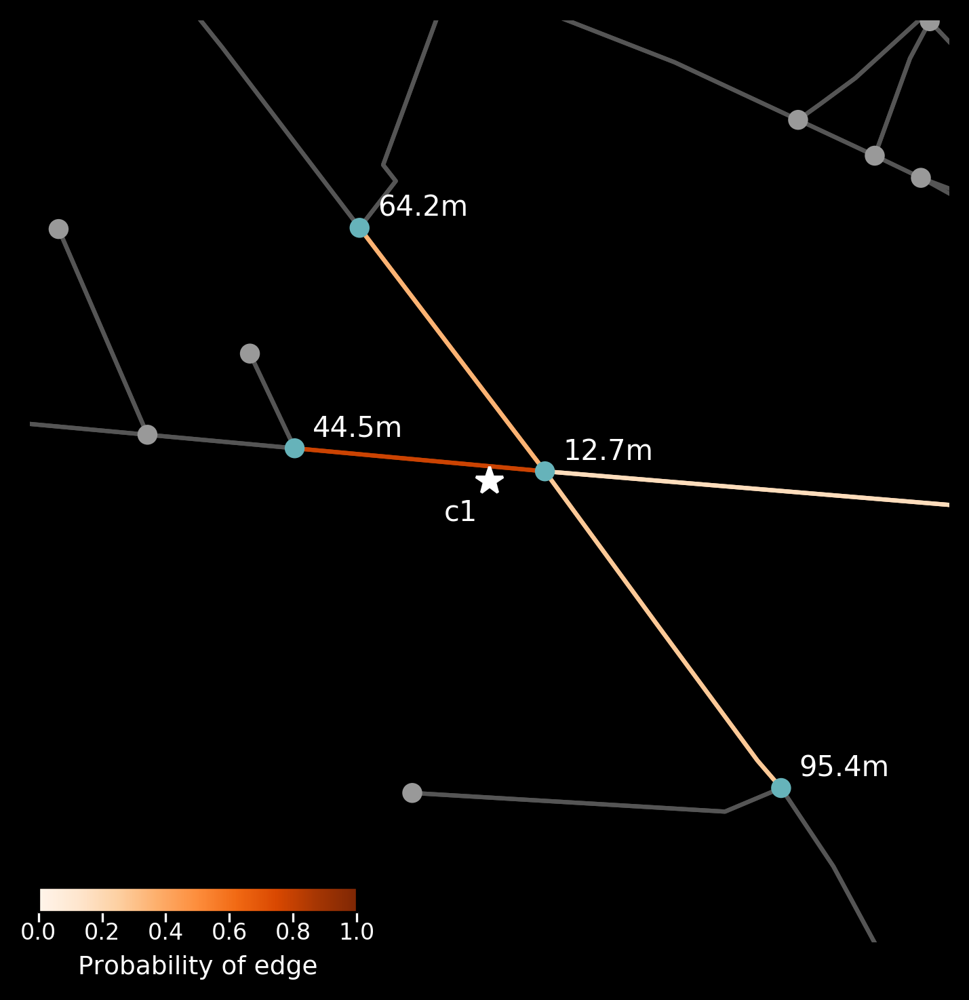

[](https://travis-ci.org/PedrosWits/anprx)

[](https://anprx.readthedocs.io/en/latest/?badge=latest)

[](https://badge.fury.io/py/anprx)

# ANPRx

Traffic analysis using networks of Automatic Number Plate Recognition cameras.

## Installation

ANPRX is available through pypi:
```
pip install anprx
```

See `requirements.txt` for a complete list of dependencies.

## Usage Example

```python
import anprx

# Using the same dummy location twice
locations = [ anprx.Point(lat = 54.974537,
                          lng = -1.625644),

              anprx.Point(lat = 54.974537,
                          lng = -1.625644)
            ]

network = anprx.get_surrounding_network(locations)

# With address filtering
fake_camera1 = anprx.Camera(
  network = network,
  id = "c1",
  point = locations[0],
  address = "Pitt Street, Newcastle Upon Tyne, UK",
  filter_by_address = True)

fake_camera1.plot()

# Without address filtering
fake_camera2 = anprx.Camera(
  network = network,
  id = "c2",
  point = locations[1])

fake_camera2.plot()
```

Fake camera on Pitt Street with address filtering |  Fake camera on Pitt Street without address filtering
:-------------------------:|:-------------------------:
  |  

## Features

### Stable

Given the pair of latitude and longitude coordinates of each camera, you can:

- Obtain a model of the drivable street network, using [osmnx](https://github.com/gboeing/osmnx) and [networkx](https://networkx.github.io/documentation/stable/index.html), that encompasses the cameras (coordinate points).
- Compute the likelihood of neighbouring edges (road segments) as the true edge observed by the camera. Filter out candidate edges by address.
- Visualise the camera's placement on the road network, including nearby nodes, and the likelihood of candidate edges.

### Under development

Among others:

- Enrich the road network by adding further attributes to the edges (address details, elevation, bearing).
- Filter/compress the road network based on edge attributes.
- Batch analysis of ANPR data: trip identification and inference.

## Documentation

All modules and methods are documented in [anprx.readthedocs.io]()

## License
[Apache v2.0](LICENSE)
